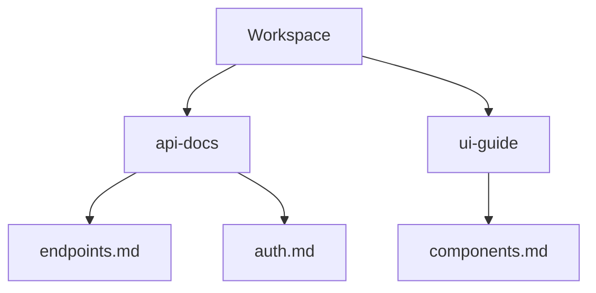

## Overview

V4c provides powerful tools to manage your project documentation efficiently. You organize content into folders, edit with rich formatting, collaborate in real-time, and search quickly. These features help teams maintain clear, up-to-date docs.

<Columns cols={3}>
  <Card title="Document Organization" icon="folder" href="#document-organization">
    Structure your docs with nested folders and intuitive navigation.
  </Card>
  <Card title="Editing Tools" icon="edit-3" href="#editing-tools">
    Format content using Markdown with live previews.
  </Card>
  <Card title="Collaboration" icon="users" href="#collaboration">
    Share, review, and co-edit documents seamlessly.
  </Card>
</Columns>

<Callout kind="tip">
  Start by creating a new workspace to group related documentation projects.
</Callout>

## Document Organization and Folders

You create hierarchical folder structures to keep documentation organized. Folders support unlimited nesting, making it easy to mirror your project architecture.

<Steps>
  <Step title="Create a Folder" icon="folder-plus">
    Navigate to your workspace root. Click the `+` button and select `New Folder`. Name it `api-docs`.
  </Step>
  <Step title="Add Documents" icon="file-plus">
    Inside the folder, create new Markdown files like `endpoints.md`.
  </Step>
  <Step title="Rearrange" icon="move">
    Drag and drop files or folders to reorder them.
  </Step>
</Steps>



## Editing and Formatting Options

V4c supports Markdown editing with syntax highlighting and live previews. You access advanced formatting through a toolbar or shortcuts.

<Tabs>
  <Tab title="Basic Formatting" icon="type">
    Use standard Markdown:

````markdown
# Heading 1
## Heading 2

**Bold text**
_Italic text_

- List item
- Another item
````

  </Tab>
  <Tab title="Code Blocks" icon="code">
    Highlight code with language tags:

````markdown
```javascript
function greet(name) {
  return `Hello, ${name}!`;
}
```
````

  </Tab>
  <Tab title="Tables" icon="table">
    Create tables easily:

````markdown
| Feature | Description |
|---------|-------------|
| Folders | Nested organization |
| Search  | Full-text filtering |
```
````

  </Tab>
</Tabs>

<CodeGroup tabs="Markdown,HTML">
```markdown
> Blockquote for quotes.
```
```html
<blockquote>Blockquote for quotes.</blockquote>
```
</CodeGroup>

## Collaboration and Sharing Features

Invite team members to collaborate. You control permissions like view, edit, or admin access. Real-time cursors show who edits what.

<Expandable title="Set Up Collaboration" default-open="true">
  1. Open document settings.
  2. Click `Share` and enter emails.
  3. Select roles: `Editor` or `Viewer`.

  Changes sync instantly, with version history to revert if needed.
</Expandable>

<Callout kind="alert">
  Always review changes before publishing shared docs to avoid conflicts.
</Callout>

## Search and Filtering Tools

Search across all documents with full-text matching. Filter by folder, tags, or date modified.

| Filter Type | Example Usage | Result |
|-------------|---------------|--------|
| Keyword    | `api endpoint` | Matches titles and content |
| Folder     | `in:api-docs`  | Limits to specific folder |
| Tag        | `#urgent`      | Shows tagged items |
| Date       | `modified:>2024-01-01` | Recent changes |

<Expandable title="Advanced Search Tips">
  Combine filters: `auth #security in:api-docs`. Use quotes for phrases: `"user login"`.
</Expandable>

## Next Steps

<Columns cols={2}>
  <Card title="Quickstart" icon="zap" href="/quickstart">
    Set up your first workspace.
  </Card>
  <Card title="Advanced Editing" icon="settings" href="/advanced-editing">
    Explore custom themes and plugins.
  </Card>
</Columns>