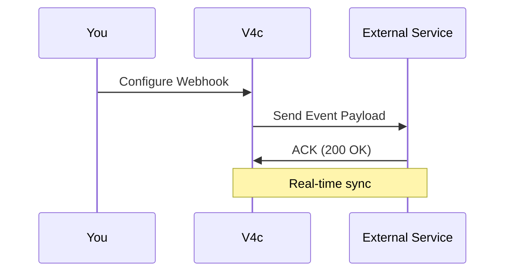

## Overview

V4c supports seamless integrations with popular third-party services. You can set up webhooks for real-time notifications, embed external content directly into your docs, and export your documentation to various formats. These features streamline your workflow and keep your team in sync.

<Callout kind="info">
  All integrations use secure HTTPS endpoints at `https://api.example.com/v1`.
</Callout>

## Supported Integrations

Connect V4c to your favorite tools using native integrations or webhooks.

<Columns cols={3}>
  <Card title="Slack" icon="message-circle" href="https://slack.com" target="_blank">
    Send doc update notifications to Slack channels.
  </Card>
  <Card title="GitHub" icon="github" href="https://github.com" target="_blank">
    Sync documentation with GitHub repositories automatically.
  </Card>
  <Card title="Google Workspace" icon="file-text" href="https://workspace.google.com" target="_blank">
    Import and embed Google Docs or Sheets.
  </Card>
</Columns>

## Setting Up Webhooks

Webhooks notify external services about events like doc updates or publishes. Follow these steps to configure one.

<Steps>
  <Step title="Create Webhook" icon="plus">
    Navigate to your project settings > Integrations > Webhooks. Click "New Webhook".
  </Step>
  <Step title="Configure Endpoint" icon="link">
    Enter your endpoint URL, e.g., `https://your-webhook-url.com/v4c-events`.
  </Step>
  <Step title="Select Events" icon="zap">
    Choose events like `doc.updated` or `doc.published`.
  </Step>
  <Step title="Test and Save" icon="check-circle">
    Send a test payload and save the webhook.
  </Step>
</Steps>

### Webhook Payload Example

V4c sends JSON payloads to your endpoint. Verify your server handles `POST` requests with `Content-Type: application/json`.

<CodeGroup tabs="JavaScript,Python">
  ```javascript
  // Example handler (Node.js/Express)
  app.post('/v4c-events', (req, res) => {
    const event = req.body;
    if (event.type === 'doc.updated') {
      console.log(`Doc ${event.data.id} updated: ${event.data.title}`);
    }
    res.status(200).json({ received: true });
  });
  ```
  ```python
  # Example handler (Flask)
  from flask import Flask, request, jsonify
  app = Flask(__name__)

  @app.route('/v4c-events', methods=['POST'])
  def webhook():
      event = request.json
      if event['type'] == 'doc.updated':
          print(f"Doc {event['data']['id']} updated: {event['data']['title']}")
      return jsonify({'received': True}), 200
  ```
</CodeGroup>

<ParamField path="webhook_url" param-type="string" required="true">
  Your public HTTPS endpoint to receive payloads.
</ParamField>

<ParamField header="V4c-Signature" param-type="string" required="false">
  HMAC SHA-256 signature for payload verification using your secret.
</ParamField>

## Embedding External Content

Embed live content from third-party services to keep your docs dynamic.

<Tabs>
  <Tab title="YouTube Video" icon="video">
    Use the embed code from YouTube.

    <Video
      src="https://www.youtube.com/embed/dQw4w9WgXcQ"
      title="Sample V4c Integration Demo"
      width="560"
      height="315"
    />
  </Tab>
  <Tab title="Google Form" icon="file">
    Paste the iframe src from Google Forms.

    <Iframe
      src="https://docs.google.com/forms/d/e/sample-form/viewform"
      title="Feedback Form"
      width="100%"
      height="600"
    />
  </Tab>
</Tabs>

## Exporting Documentation

Export your V4c docs to PDF, HTML, or Markdown for sharing outside the platform.

<Expandable title="Advanced Export Options" default-open="false">
  Use the API for bulk exports:

  ```bash
  curl -X POST https://api.example.com/v1/projects/{project_id}/export \
    -H "Authorization: Bearer YOUR_API_KEY" \
    -H "Content-Type: application/json" \
    -d '{
      "format": "pdf",
      "include_images": true
    }'
  ```

  Formats: `pdf`, `html`, `md`.
</Expandable>

<Callout kind="tip">
  Check the [API Reference](/api-reference) for rate limits on exports.
</Callout>



This setup ensures your documentation stays connected and up-to-date across tools.